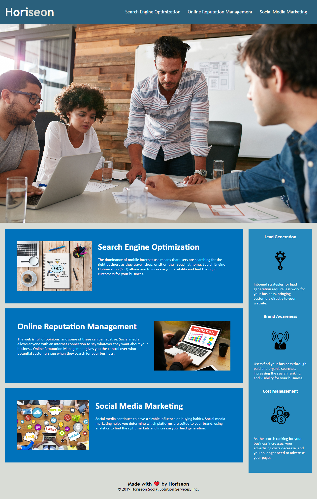

# Module-1 Challenge: Horiseon Webpage Refactoring

## Description

In order to learn more about efficient and accessible code, I refactored this webpage using semantic HTML elements, structured elements in a logical flow, added alt text to any images or icons included in the webpage, managed organization of heading attributes, and added a concise title. This challenge was taken on in order to make an existing webpage more accessible and improve long-term sustainability for the webpage.

## Installation

N/A

## Usage

Application deployed at the following link: https://park-d.github.io/module-1/

At the top of the webpage, there are 3 links to the webpage content, Search Engine Optimization, Online Reputation Management, Social Media Marketing. When a link it clicked, it brings the user to the respective section to learn more. See screenshot of full webpage below.

## License

N/A